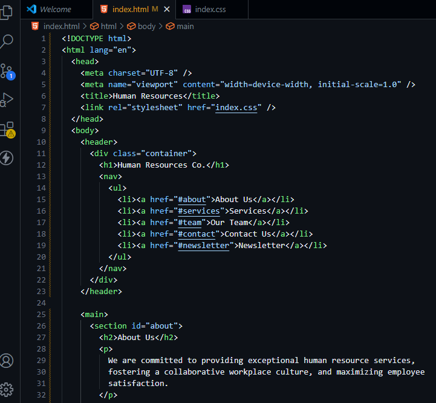

GIT-VERSION-CONTROL-BASICS

## MINI-PROJECT 2

#### This project requires two developers to collaborate on a project.

## Initial setup:
- step 0

### git init initialise a new repository

- step 1
### Tom clones repository from the central repository to his local machine

- step 2
### Jerry clones repository from the central repository to his local machine

- step 3
### Tom's pull request

- step 4
### Tom's branch update-navigation

- step 5
### Jerry's branch add-contact-info

- step 6
### index.html in the central repository before any edit by Tom and Jerry

- step 7
### Tom's update on Navigation-bar by adding a Newsletter

- step 8
### Jerry's update on add-contact-info. E-mail added

- step 9
### Jerry commits his branch

- step 10
### Jerry push his branch to central repository

- step 11
### Tom push his branch to central repository

- step 12
### Jerry's commit message

- step 13
### Tom's updated committed message on github

### Jerry's updated committed with message on github

- step 13

- step 14

### Tom's merging and creating a pull request for update-navigation

- step 15
### The team merging Jerry's addition to the main project

- step 16

